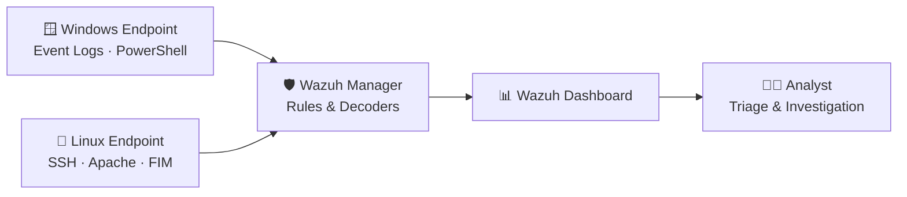
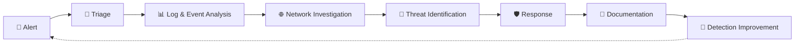

<!-- ===================== HEADER ===================== -->
<div align="center">


<a href="https://git.io/typing-svg">
  
</a>

<br><br>

<a href="https://www.linkedin.com/in/ahmed-mohammed-2e2/"></a>
<a href="mailto:ahmedeffat75@gmail.com"></a>


</div>

---

## 👨‍💻 About Me

I'm a cybersecurity enthusiast focused on **SOC analysis**, **network security**, and **threat detection**. I learn by doing: I build labs, generate real attack traffic, and investigate the logs, alerts, and packets it leaves behind.

> 🎯 **My goal:** turn raw security data into actionable insights that catch threats earlier and make incident response faster and more accurate.

```text
$ whoami
ahmed_effat

$ cat profile.txt
role        : Aspiring SOC Analyst
focus       : SIEM · Log Analysis · Network Forensics · Detection
certs       : CCNA, CEH
in_progress : Security+
lab         : Wazuh SOC Home Lab (Windows + Linux)
motto       : Detect. Investigate. Defend.
```

---

## 🛡️ Cybersecurity Focus

<table>
<tr>
<td align="center">🔎<br><b>SOC Analysis</b></td>
<td align="center">📊<br><b>SIEM & Monitoring</b></td>
<td align="center">🚨<br><b>Alert & Log Analysis</b></td>
</tr>
<tr>
<td align="center">🌐<br><b>Network Security</b></td>
<td align="center">🧠<br><b>Threat Detection</b></td>
<td align="center">🔍<br><b>Incident Investigation</b></td>
</tr>
<tr>
<td align="center">🐧<br><b>Linux & Windows Security</b></td>
<td align="center">🧪<br><b>Hands-on Labs</b></td>
<td align="center">🤖<br><b>AI-assisted Security</b></td>
</tr>
</table>

---

## 🔐 Security Toolkit

**🛡️ SOC & Detection**


**🌐 Network Security**


**🧠 Threat Intelligence & Detection**


**💻 Systems & Scripting**

<p>
&nbsp;
&nbsp;
&nbsp;
&nbsp;
&nbsp;

</p>

---

## 🧪 Hands-on Security Lab

### 🛡️ Wazuh SOC Home Lab

A practical SOC environment for monitoring and investigating security events across **Windows** and **Linux** endpoints.



| Area | What I practice |
|---|---|
| 🚨 **Alert triage** | Investigating Wazuh alerts and separating true from false positives |
| 📝 **Windows logs** | Event Log analysis, logon events, account activity |
| ⚡ **PowerShell** | Monitoring suspicious script and command execution |
| 🔐 **SSH** | Investigating failed logins and brute-force patterns |
| 🌐 **Web logs** | Apache access/error log analysis |
| 📁 **FIM** | File Integrity Monitoring for unauthorized changes |
| 🧠 **MITRE ATT&CK** | Mapping observed activity to attack techniques |

### 🗺️ ATT&CK Coverage in My Lab

| Tactic | Technique | Data source |
|---|---|---|
| Credential Access | `T1110` Brute Force | SSH auth logs |
| Initial Access | `T1078` Valid Accounts | Windows logon events |
| Execution | `T1059.001` PowerShell | PowerShell / Windows logs |
| Initial Access | `T1190` Exploit Public-Facing App | Apache logs |
| Defense Evasion / Impact | File tampering | File Integrity Monitoring |

<details>
<summary><b>💡 Example: Wazuh rule for SSH brute-force detection (click to expand)</b></summary>

<br>

```xml
<group name="local,sshd,">
  <rule id="100100" level="10" frequency="6" timeframe="120">
    <if_matched_sid>5760</if_matched_sid>
    <same_source_ip />
    <description>Possible SSH brute force: 6+ failed logins from one IP in 2 minutes</description>
    <mitre>
      <id>T1110</id>
    </mitre>
  </rule>
</group>
```

</details>

---

## 🚀 Projects

### 🧠 AI-Assisted Incident Hypothesis Generator

An AI-assisted tool that analyzes security events and generates **confidence-scored incident hypotheses**, helping analysts decide where to look first during an investigation.


<!-- 👉 Add your repo link: [View Project](https://github.com/ahmedeffat6/YOUR-REPO) -->

---

## 📝 Investigation Write-ups

> Case studies from my lab, each following the same structure. Add links as you publish them.

| Case | Technique | Tools | Write-up |
|---|---|---|---|
| SSH Brute Force Investigation | `T1110` | Wazuh, auth.log | 🔜 Coming soon |
| Suspicious PowerShell Activity | `T1059.001` | Wazuh, Windows Event Logs | 🔜 Coming soon |
| Web Attack on Apache | `T1190` | Wazuh, Apache logs | 🔜 Coming soon |
| Suspicious Traffic Analysis | Network | Wireshark | 🔜 Coming soon |

---

## 🔍 My SOC Investigation Workflow



---

## 🎓 Certifications & Learning Path


**🧭 Roadmap**

- [x] Networking fundamentals (CCNA)
- [x] Ethical hacking fundamentals (CEH)
- [x] Wazuh SOC home lab
- [ ] CompTIA Security+
- [ ] Publish investigation write-ups
- [ ] Custom detection rules & Sigma rules
- [ ] Blue team certification (e.g. BTL1 / CySA+)

---

## 📊 GitHub Stats

<div align="center">


<br><br>


<br><br>


</div>

---

## 📫 Let's Connect

<div align="center">

I'm always happy to talk SOC work, detection ideas, or lab setups.

<a href="https://www.linkedin.com/in/ahmed-mohammed-2e2/"></a>
<a href="mailto:ahmedeffat75@gmail.com"></a>

<br><br>

**🛡️ Detect • Investigate • Secure**


</div>
